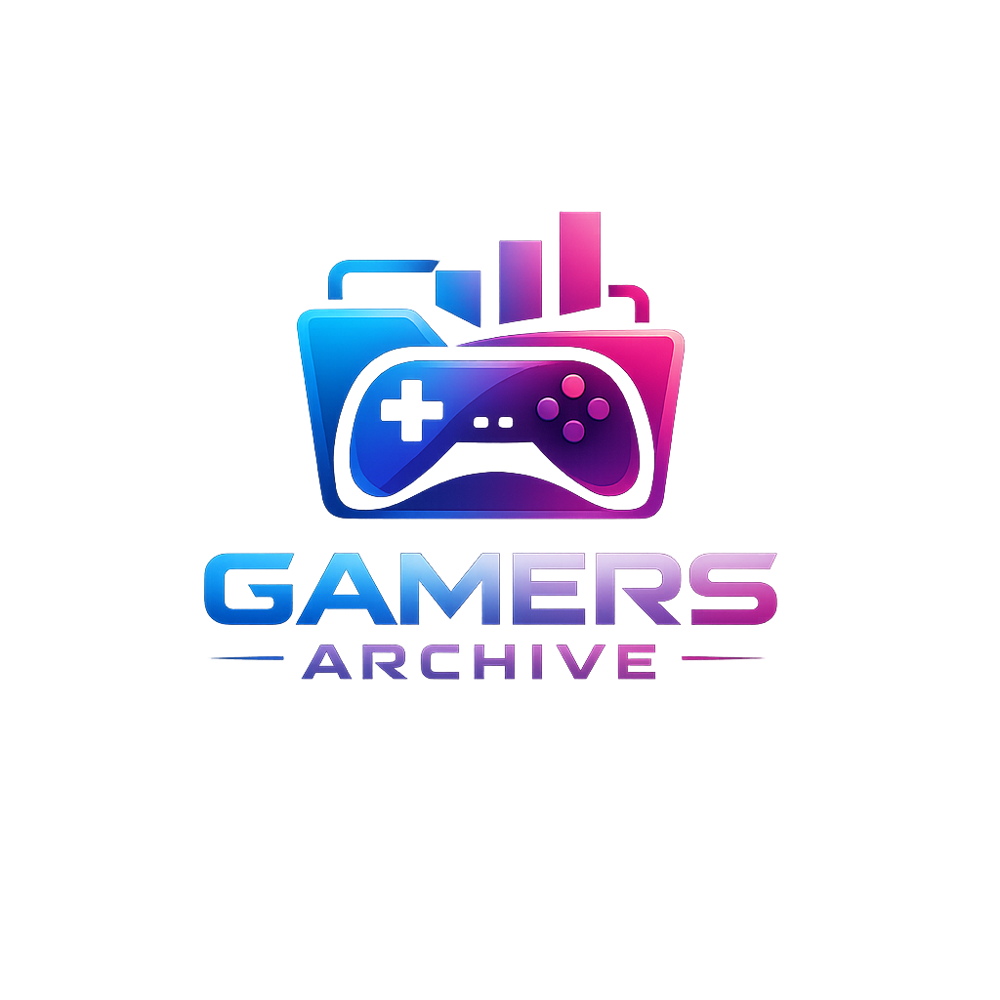

# 🎮 Gamers Archive

## 📖 Description

Gamers Archive is a full-stack MERN application that allows users to discover, save, and manage their favorite video games.  

The application integrates with the IGDB API to fetch game data and allows authenticated users to create, update, and delete personalized game entries.

Users can:
- Sign up / Sign in securely using JWT authentication
- Browse game data powered by IGDB
- Create and manage personal game collections
- Perform full CRUD operations on their saved games
- Edit only the content they created

This project was built as a group MERN Stack CRUD application to demonstrate full-stack development skills including authentication, authorization, RESTful routing, and secure API integration.

---

## 🚀 Getting Started

## User Stories
- as a user I would like to create a secure account, login and logout using a nav bar
- as a user I'd like to browse search feature and add games to my library
- as a user I'd like to write reviews for games 
- as a user I would like to explore my existing library and other community members libraries
- as a user I'd like to see the game details as well as my own progress towards individual games
- as a user i'd like to edit and delete games from my library and reviews

### 🔗 Deployed Application
[Live App Link Here]

### 📋 Planning Materials

┌──────────────┐       ┌──────────────────┐       ┌──────────────┐
│    User       │       │   LibraryItem     │       │   ApiGame     │
├──────────────┤       │   (join table)    │       ├──────────────┤
│ _id (PK)      │──1:M──│ userId (FK)        │──M:1──│ _id (PK)      │
│ username      │       │ gameId (FK)        │       │ igdbGameId    │
│ email         │       │ status            │       │ title         │
│ password      │       │ hoursPlayed       │       │ coverUrl      │
│ avatar        │       │ notes             │       │ summary       │
│ createdAt     │       │ owned             │       │ releaseDate   │
└──────┬───────┘       │ createdAt         │       │ rating        │
       │                └──────────────────┘       │ platform[]    │
       │                                            │ genre[]       │
       │                ┌──────────────────┐       │ source        │
       │                │     Review        │       │ createdAt     │
       │                │   (join table)    │       └──────┬───────┘
       └───────1:M──────│ author (FK)        │              │
                        │ gameId (FK)        │──M:1─────────┘
                        │ rating            │
                        │ Text              │
                        │ createdAt         │
                        │ UNIQUE(gameId,    │
                        │        author)    │
                        └──────────────────┘

### 🛠 Back-End Repository

https://github.com/andyperciballi/gamers-archive-backend

---

## 🧱 Technologies Used

### Front-End
- React
- React Router
- JavaScript (ES6+)
- CSS (Flexbox / Grid)
- Axios (or Fetch API)

### Back-End
- Node.js
- Express
- MongoDB
- Mongoose
- JSON Web Tokens (JWT)
- bcrypt

### External API
- IGDB API (accessed securely via back-end)

---

## 🔐 Authentication & Authorization

- JWT-based authentication
- Secure sign up, sign in, sign out functionality
- Protected routes on front-end and back-end
- Only the creator of a resource can edit or delete it
- Guests cannot create, update, or delete data

---

## 🗂 Entity Relationship Overview

- User
- APIGame
- Library Item
- Review

Library items are owned by users but API Game items store a larger dataset relating to a library item. Reviews are tied to the API game and not the library item so if users remove games from libraries the game will retain the reviews

## 🎨 UI/UX Features

- Consistent visual theme and color palette
- Responsive layout using Flexbox/Grid
- WCAG AA color contrast compliance
- Styled buttons throughout
- Forms are pre-filled when editing data
- Navigation via links (no manual URL typing required)
- All images include alt text

---

## 📸 Screenshots

### Home Page

### Dashboard

---

## 🙏 Attributions

- [IGDB API](https://api-docs.igdb.com/)
- Any icon libraries (e.g., Font Awesome)
- Any UI inspiration or assets used
- Claude Code, ChatGPT and Emmet abbreviations for Code guidance
- ChatGPT for logo design
- General Assembly Class notes and lecture materials 

---

## 🔮 Next Steps (Stretch Goals)

- Add user profile customization
- Add sorting and filtering functionality
- Add pagination or infinite scroll
- Improve search functionality
- Add social features (friends, sharing lists)
- Add dark mode

---

## 👥 Contributors

- Andrew Perciballi
- Felicia Bossom
- William De Los Santos

---

## 📦 Repositories

Front-End Repo: [https://github.com/andyperciballi/gamers-archive-react-frontend]
Back-End Repo: [https://github.com/andyperciballi/gamers-archive-backend]
